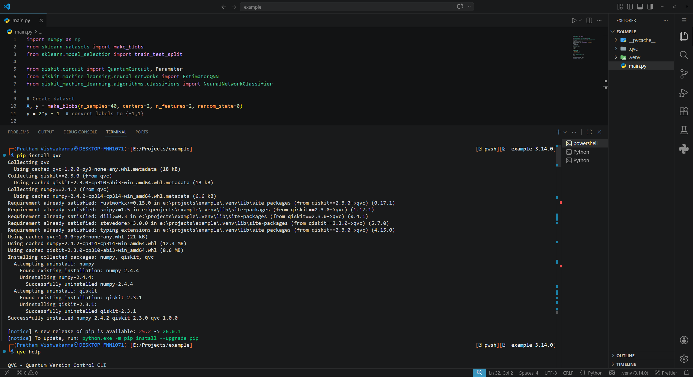
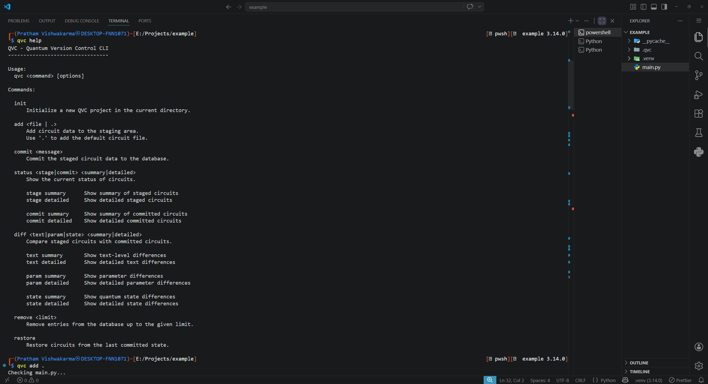
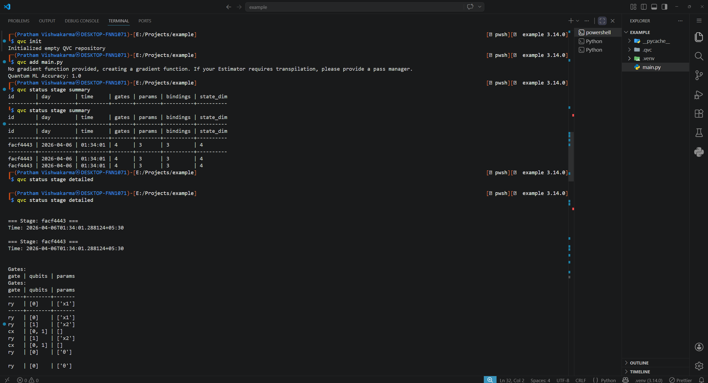
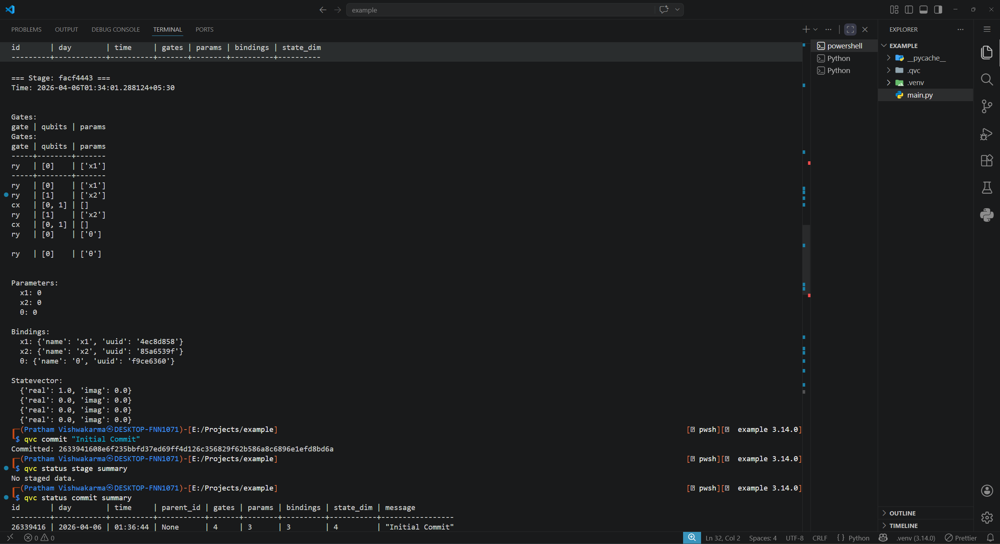

# QVC Test Repository

## Overview

This repository contains a simple **Quantum Machine Learning example using Qiskit** that was used to test **QVC – Quantum Version Control**.

The goal of this project is to provide a small Python program that can be tracked and managed using **QVC**, allowing testing of how quantum-related code changes are handled across different commits.

## About QVC

**QVC (Quantum Version Control)** is a system designed to manage and track changes in **quantum computing projects**, including:

* Quantum circuits
* Experiment parameters
* Quantum algorithms
* Hybrid quantum–classical workflows

This repository serves as a **test project** for validating QVC functionality.

## Test Code

The included script implements a small **quantum machine learning classifier** using **Qiskit**.

The program:

1. Creates a quantum circuit with qubits
2. Encodes classical data into quantum states
3. Trains a simple quantum neural network
4. Evaluates the model accuracy

The code is intentionally **simple and deterministic** so that changes can easily be tracked using QVC.

## Screenshots

## Purpose of This Repository

This repository was used to test the following **QVC features**:

* Initializing a QVC project
* Tracking Python files
* Staging files
* Committing experiment updates
* Comparing differences between commits
* Restoring previous versions

## Technologies Used

* Python
* Qiskit
* Qiskit Machine Learning
* Scikit-learn

## Note

This repository is intended **only for testing and demonstrating QVC functionality** and should be treated as an example experiment project rather than a production system.
